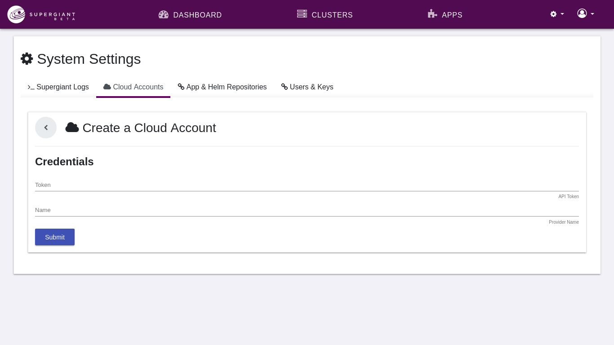
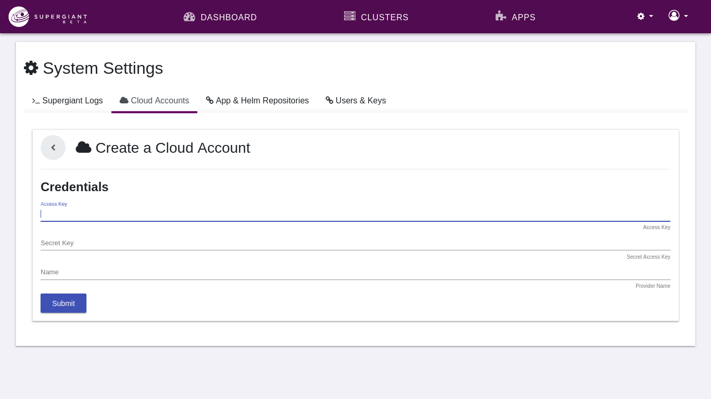
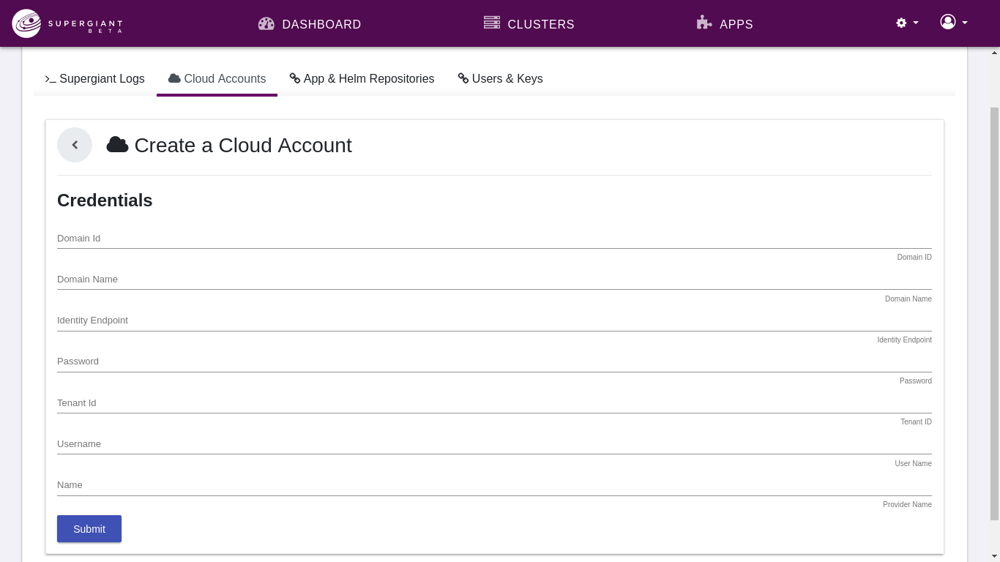

# Cloud Account

A Cloud Account is a simple object that holds API access credentials (e.g., API token, security keys) for any supported Provider (e.g., GCE, AWS). It is the parent object of [Kubes](http://supergiant.readthedocs.io/en/v1.0.0/Concepts/kube/).  Credentials are validated by an API call to the respective Provider.

## DigitalOcean

## Amazon AWS

## OpenStack

See the **[Linking Cloud Accounts](http://supergiant.readthedocs.io/en/v1.0.0/Using%20the%20UI/cloud_accounts/)** guide for more detailed information about linking cloud accounts in Supergiant 1.0.0