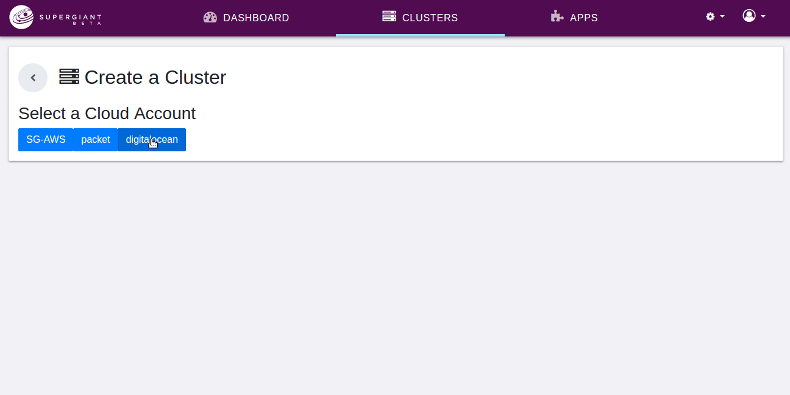

# Kube

A Kube represents a Kubernetes cluster. It belongs to a [CloudAccount](supergiant.readthedocs.io/en/v1.0.0/Concepts/cloud_account/), and it is the logical parent of [Nodes](supergiant.readthedocs.io/en/v1.0.0/Concepts/node/), [LoadBalancers](supergiant.readthedocs.io/en/v1.0.0/Concepts/load_balancer/), and [KubeResources](supergiant.readthedocs.io/en/v1.0.0/Concepts/kube_resource/). It encompasses all hardware-related assets such as the instances or servers used to host Masters and Nodes, other cloud components used for networking, and even software-related assets such as applications deployed to the cluster.

Configuration for Kubes differs across cloud providers, but all Kubes conatain information on Node Sizes (the machine/instance types that the [Capacity Service](supergiant.readthedocs.io/en/v1.0.0/Concepts/capacity_service/) is allowed to choose from when auto-scaling the cluster), Kubernetes Version, Public Key, and Name.

Supergiant allows deploying Kubernetes clusters (Kubes) via the easy-to-use interface with the minimal configuration required. The system manages Kubernetes installation and configuration under the hood enabling various Master and Node tools.

## Creating Kubes

### Amazon AWS

### DigitalOcean

See the [Deploying Clusters](supergiant.readthedocs.io/en/v1.0.0/Using%20the%20UI/deploying_kubes/) guide for more detailed information about cluster configuration and deployment for each supported provider.
