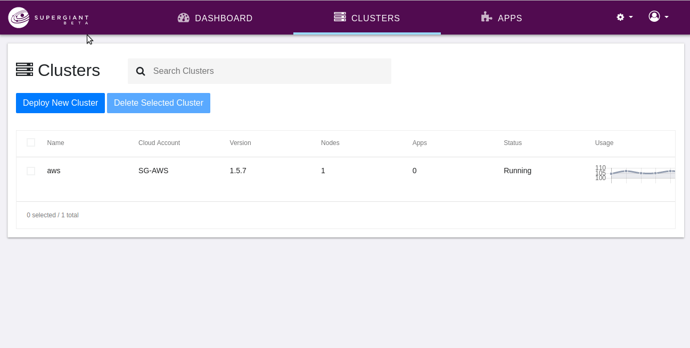

# Adding Nodes

To create a new node, first select the cluster to which you want to add the node. Then, in the "**Nodes**" section of the cluster resources, select a node type (e.g., `m4.large` for Amazon EC2) from the dropdown list, and click "**Create Node**." A new node will immediately be added to your cluster. 

