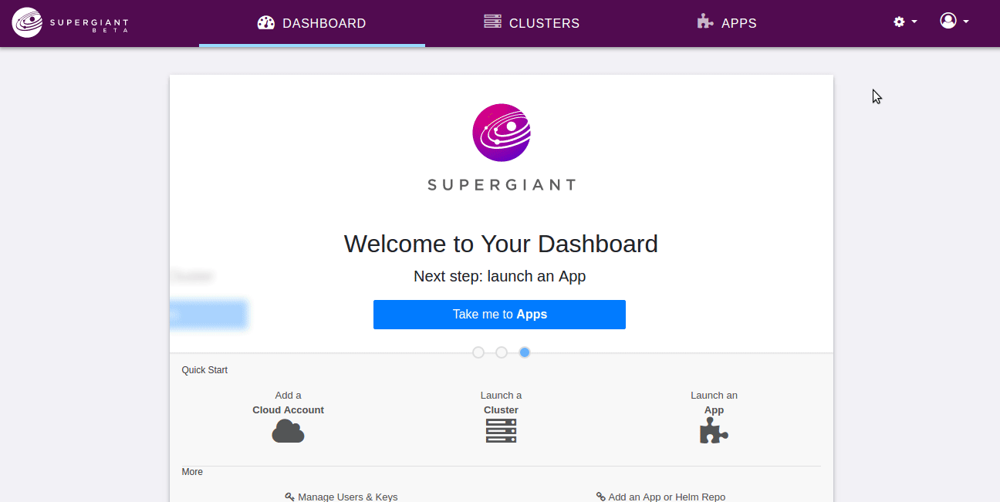

# User

A User is an entity with user credentials (**username/password**) and a role. The `role` can be "admin" or "user", the latter being restricted from creating additional Users. Supergiant supports adding new Users via UI and Supergiant API. 

### Adding a New User in Supergiant Dashboard

To add a new user, first click **Profile -> Users & Keys**. In a new window, you'll see a list of existing users and a 'new user' form. Enter the Username and Password into the respective form fields and click "**Add New User**" and the new user will be created almost instantly. 



### Adding a New User with Supergiant API

#### Request

```json
{
  "username": "username",
  "password": "password",
  "role": "user"
}
```

#### Response

```json
{
  "username": "username",
  "role": "user",
  "api_token": "GENERATED_API_TOKEN"
}
```

